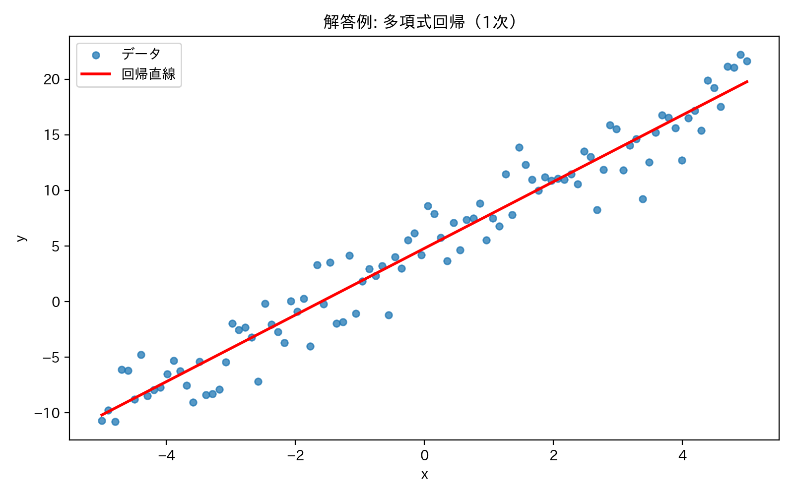
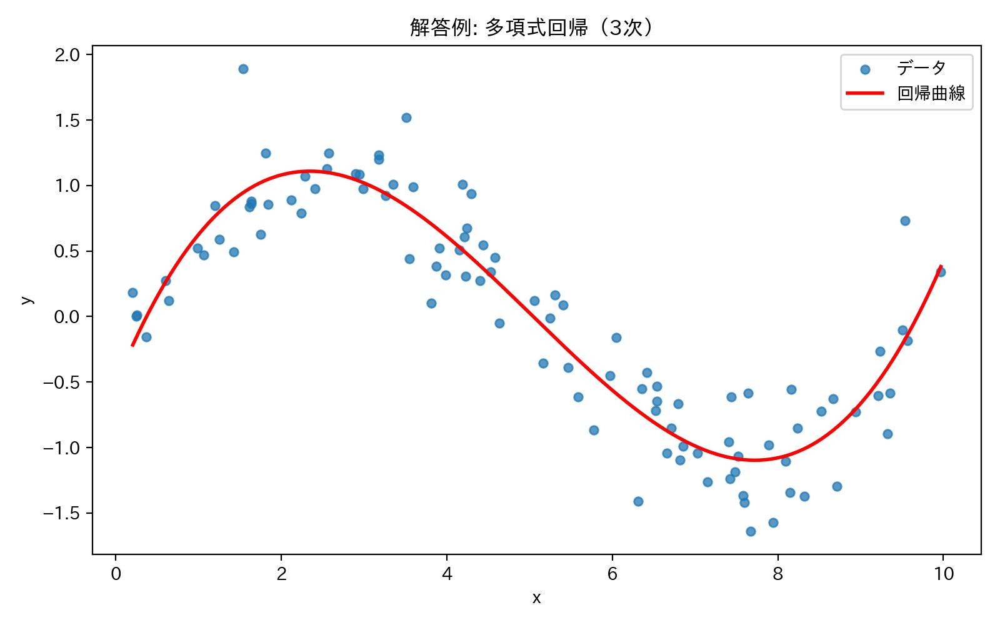
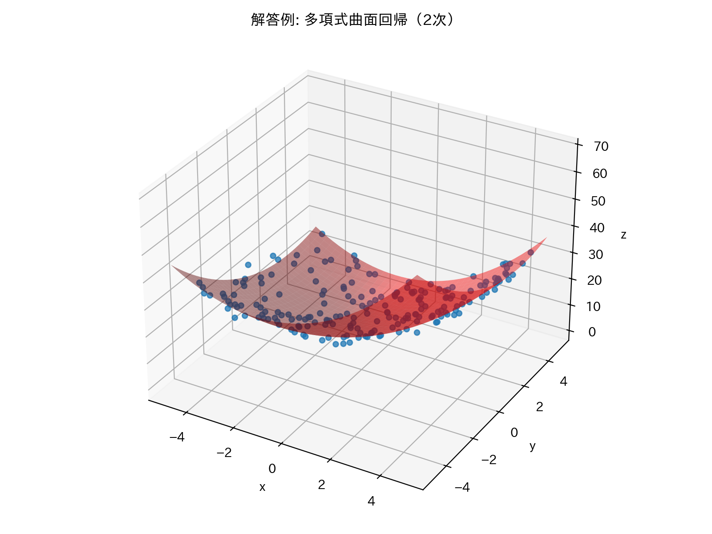
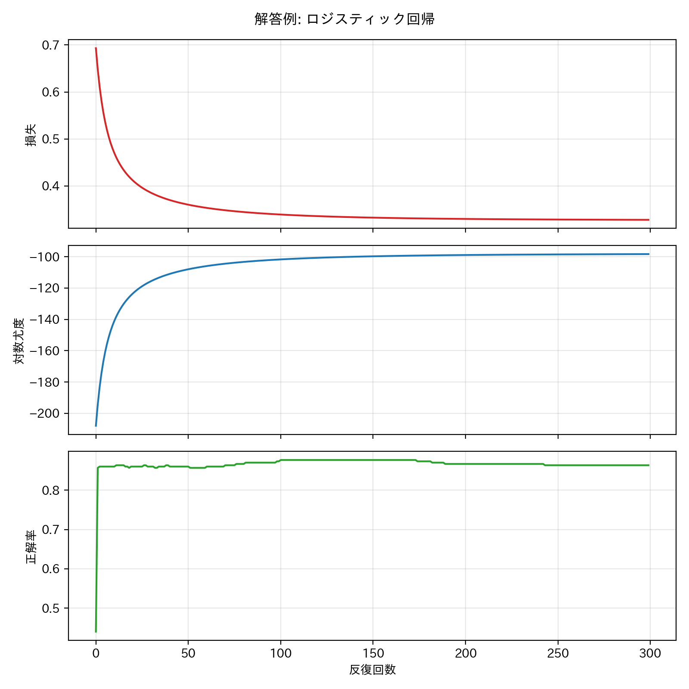

# 第1回B4輪講課題

## 概要

  > [!WARNING]
  > - 本課題でのコーディングエージェントやAIツールの利用禁止（コンペまではAIツール無しで，考えて実装する力を養成するため）   
  > - numpyの行列演算を使って実装すること

本課題では, 線形回帰およびロジスティック回帰を行う

## データセット `data/` について
- `sample2d_1.csv`: 2次元の回帰用データ
- `sample2d_2.csv`: 2次元の回帰用データ
- `sample3d.csv`: 3次元の回帰用データ
- `sample_logistic.csv`: ラベルはシグモイド(slope=1.2)で確率的に生成

## 課題

### 1-1 回帰（2次元・3次元）
- `data/` ディレクトリにある CSV ファイルからデータを読み込むこと。
- まずデータを可視化し、点の並び方を観察すること。
- 観察結果をもとに、線形・多項式・曲面など、適切だと思うモデルを考えること。
- numpy の行列演算を使って重み `w` を推定すること。
- 元データとフィッティング結果を重ねて可視化すること。

取り組むデータ:

- `sample2d_1.csv`
- `sample2d_2.csv`
- `sample3d.csv`

`sample2d_2.csv` と `sample3d.csv` では、最初から式の形を決め打ちしないこと。
散布図や3Dプロットを確認し、必要なら複数の次数を試して、どのモデルが妥当かを考察すること。


### 1-2 ロジスティック回帰（勾配降下法）
- `data/` ディレクトリにある 2 クラス分類用 CSV を読み込むこと。
- 勾配降下法によるロジスティック回帰を自前実装すること。
- 各イテレーションごとに以下を記録し、学習曲線として可視化すること。
  - 尤度（対数尤度）
  - 損失関数（クロスエントロピー）
  - 分類精度（accuracy）
取り組むデータ:
- `sample_logistic.csv`

### 出力例






### 発展
- 他の metrics なども調査し，可視化などをし，性能向上を試みる
- 必要以上に高い次数でフィッティングしたときに何が起こるかを観察する
- 過学習や正則化について調査し，Ridge 回帰や Lasso 回帰などを試す

## Python環境を構築する上で参考になるリンク
- venv
  - 計算機サーバーで使うとき
    - https://www.notion.so/todalab/studynotes-105468eeb10d8081bafce5a55754f615#105468eeb10d8022b534c21890406175
  - windowsで使うとき
    - https://www.notion.so/todalab/venv-version-13d468eeb10d807fa432d1a1f56988b9
- uv（ナウい(?)）
  - https://www.notion.so/todalab/B4-uv-341468eeb10d80248511de4ea59f655c?source=copy_link

## 発表（次週）
- 取り組んだ内容を周りにわかるように説明
- コードの解説
    - 工夫したところ，苦労したところの解決策はぜひ共有しましょう
- 結果の考察，応用先の調査など
- 発表資料はnas01の `internal/発表資料/B4輪講/2026/第1回` へアップロードしておくこと


## 注意

- 自分の作業ブランチで課題を行うこと
- プルリクエストをおくる際には**課題結果を可視化した画像ファイルも載せること**
- プルリクエストのコメントには，結果画像を作るために実行したコマンドも書くこと
- 作業前にリポジトリを最新版に更新すること

```
$ git checkout main
$ git fetch upstream
$ git merge upstream/main
```
