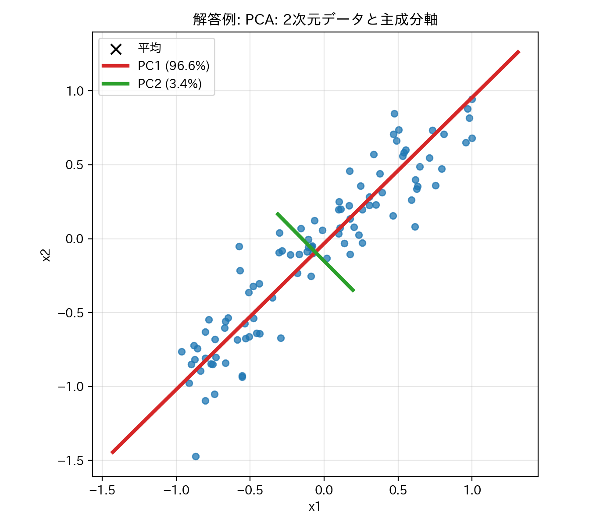
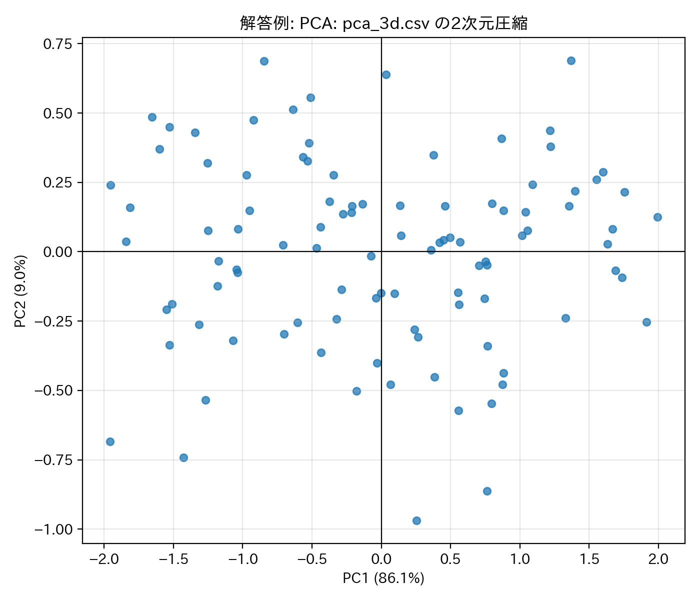
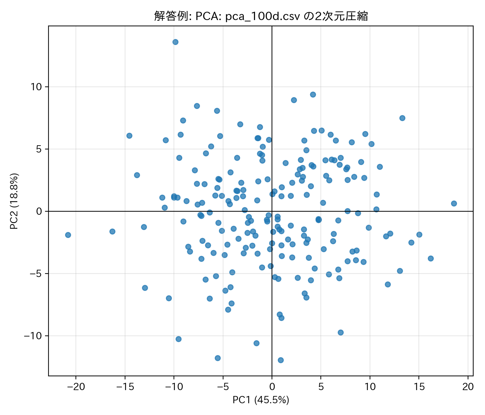
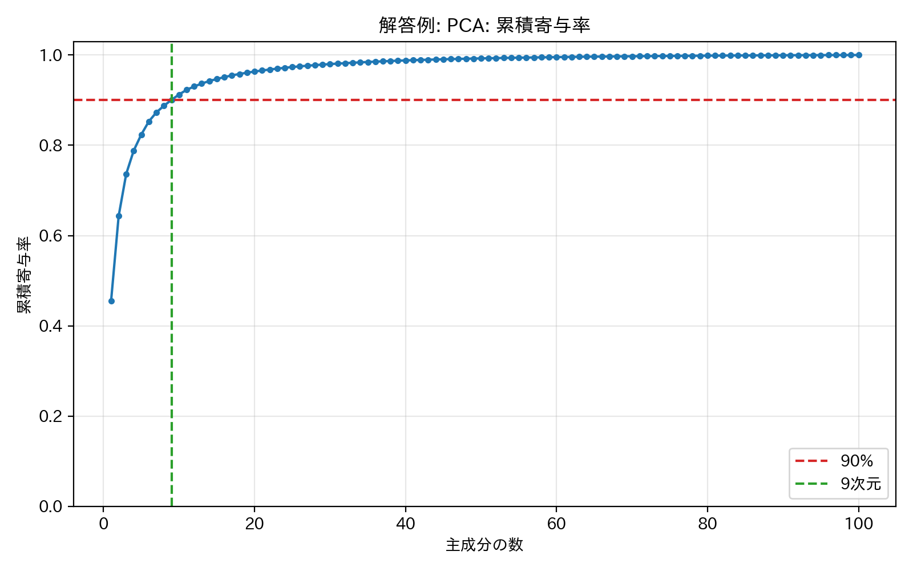
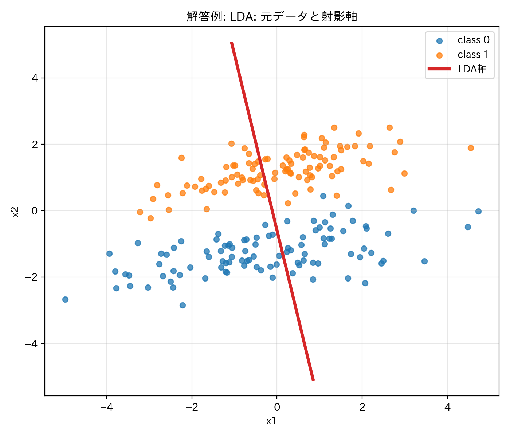
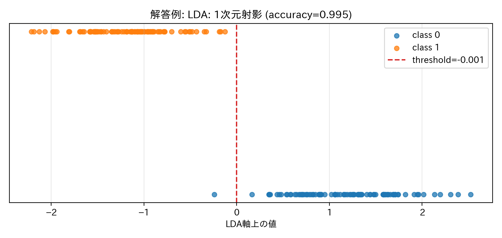

# 第2回B4輪講課題

## 概要

  > [!WARNING]
  > - 本課題でのコーディングエージェントやAIツールの利用禁止（コンペまではAIツール無しで，考えて実装する力を養成するため）
  > - numpyの行列演算を使って実装すること
  > - `sklearn` などの PCA/LDA 実装をそのまま呼び出さないこと

本課題では，主成分分析（PCA）と線形判別分析（LDA）を実装し，低次元構造の抽出とクラス識別のための射影の違いを確認する．

## データセット `data/` について

- `pca_2d.csv`: 2次元PCA用データ（ヘッダーなし）
- `pca_3d.csv`: 3次元PCA用データ（ヘッダーなし）
- `pca_100d.csv`: 100次元PCA用データ（ヘッダーなし）
- `lda_2class.csv`: 2次元2クラスLDA用データ（`x1,x2,label` のヘッダー付き）

## 課題

### 2-1 PCA

`data/` ディレクトリにある PCA 用 CSV ファイルを読み込み，PCA を自前実装すること．

実装すること:

- データを読み込み，平均中心化すること
- 共分散行列を計算すること
- 固有値問題を解き，固有値の大きい順に主成分を並べること
    - `np.linalg.eig` または `np.linalg.eigh` を使ってよい
- 各主成分の寄与率と累積寄与率を計算すること

取り組むデータ:

- `pca_2d.csv`
  - 元データの散布図を描くこと
  - すべての主成分の軸を散布図上に重ねて可視化すること
- `pca_3d.csv`
  - PCA により2次元へ圧縮し，2次元散布図として可視化すること
- `pca_100d.csv`
  - PCA により2次元へ圧縮し，2次元散布図として可視化すること
  - 累積寄与率が90%以上となる最小の次元数を求めること

### 2-2 LDA

`data/lda_2class.csv` を読み込み，LDA を自前実装すること．

実装すること:

- クラスごとの平均ベクトルを計算すること
- クラス内分散行列とクラス間分散行列を計算すること
- 一般化固有値問題を解き，LDA の射影方向を求めること
- 元データの散布図に LDA の射影軸を重ねて可視化すること
- LDA 軸へ射影した1次元データを可視化すること
- 射影後の値を使ってしきい値分類を行い，accuracy を計算すること

LDA ではクラスラベルを利用する．PCA と LDA の射影方向が何を目的として決まるのかを比較し，結果を考察すること．

### 出力例

自分で作成した可視化画像をプルリクエストに載せること．最低限，以下の画像を作成すること．

- `pca_2d.csv` の散布図と主成分軸
- `pca_3d.csv` を PCA で2次元に圧縮した散布図
- `pca_100d.csv` を PCA で2次元に圧縮した散布図
- `pca_100d.csv` の累積寄与率を示す図または表
- `lda_2class.csv` の散布図と LDA 軸
- LDA 軸へ射影した1次元データの可視化

解答例では以下のような画像が得られる．

#### PCA

`pca_2d.csv` の散布図と主成分軸．



`pca_3d.csv` を PCA で2次元に圧縮した散布図．



`pca_100d.csv` を PCA で2次元に圧縮した散布図．



`pca_100d.csv` の累積寄与率．



#### LDA

`lda_2class.csv` の散布図と LDA 軸．



LDA 軸へ射影した1次元データ．



### 発展

- LDA の accuracy 以外の指標を調査し，計算・考察する
- PCA で平均中心化のみの場合と標準化した場合の違いを調べる
- PCA と LDA 以外の次元削減や分類手法を調査する
- 図の見せ方を工夫し，結果を説明しやすくする

## Python環境を構築する上で参考になるリンク
- venv
  - 計算機サーバーで使うとき
    - https://www.notion.so/todalab/studynotes-105468eeb10d8081bafce5a55754f615#105468eeb10d8022b534c21890406175
  - windowsで使うとき
    - https://www.notion.so/todalab/venv-version-13d468eeb10d807fa432d1a1f56988b9
- uv（ナウい(?)）
  - https://www.notion.so/todalab/B4-uv-341468eeb10d80248511de4ea59f655c?source=copy_link

## 発表（次週）
- 取り組んだ内容を周りにわかるように説明
- コードの解説
    - 工夫したところ，苦労したところの解決策はぜひ共有しましょう
- 結果の考察，応用先の調査など
- 発表資料はnas01の `internal/発表資料/B4輪講/2026/第2回` へアップロードしておくこと


## 注意

- 自分の作業ブランチで課題を行うこと
- プルリクエストをおくる際には**課題結果を可視化した画像ファイルも載せること**
- プルリクエストのコメントには，結果画像を作るために実行したコマンドも書くこと
- 作業前にリポジトリを最新版に更新すること

```
$ git checkout main
$ git fetch upstream
$ git merge upstream/main
```
