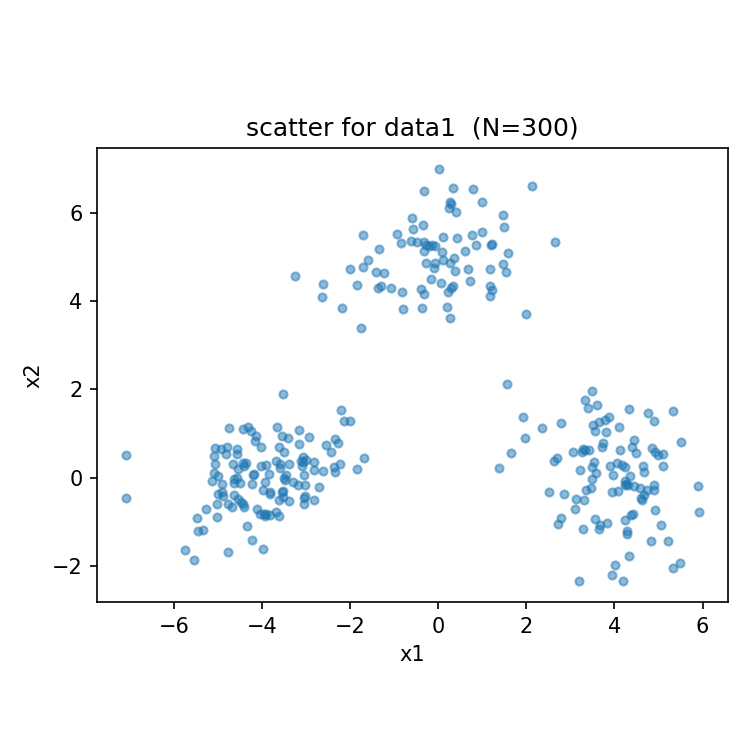
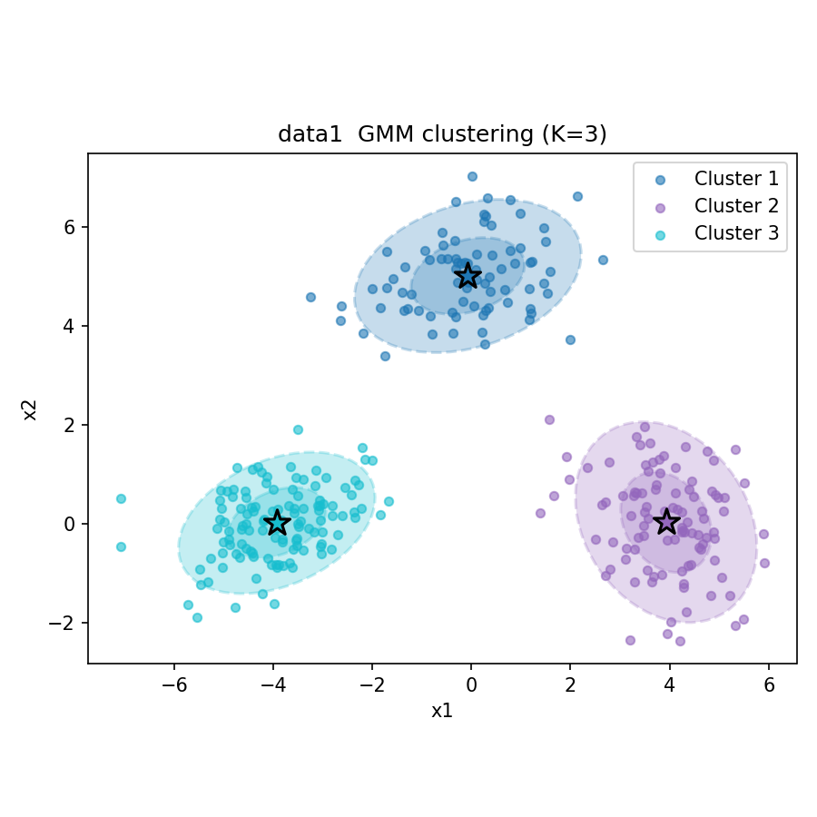
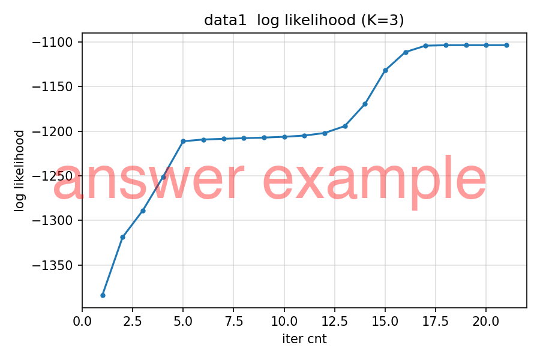
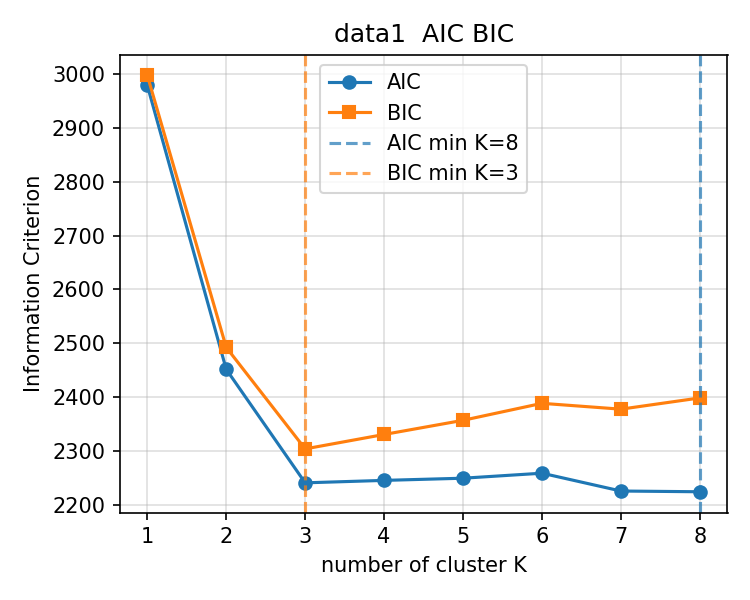

# 第3回B4輪講課題

## 概要

> [!WARNING]
> - 本課題でのコーディングエージェントやAIツールの利用禁止（コンペまではAIツール無しで，考えて実装する力を養成するため）
> - numpy の行列演算を使って実装すること
> - `sklearn` などの GMM 実装をそのまま呼び出さないこと

本課題では，混合ガウスモデル（GMM: Gaussian Mixture Model）を EMアルゴリズムで実装し，ソフトクラスタリングの仕組みを理解する．PCA/LDA が教師なし・教師あり次元削減であったのに対し，GMM は確率モデルに基づく教師なしクラスタリング手法である．

## データセット `data/` について

- `data1.csv`: 2次元データ（ヘッダーなし）
- `data2.csv`: 2次元データ（ヘッダーなし）
- `data3.csv`: 2次元データ（ヘッダーなし）

## 課題

### 3-1 データの確認

`data/` ディレクトリにある CSV ファイルを読み込み，散布図をプロットして概形を確認すること．

- 3つのデータそれぞれについて散布図を描き，クラスター構造がどのように見えるか観察すること
- この時点でクラスター数をいくつに設定するのが妥当か，目視で考察しておくこと

### 3-2 GMM の実装

EMアルゴリズムによる GMM のソフトクラスタリングを自前実装すること．

実装すること:

- **Eステップ（負担率の計算）**
  - 各データ点が各ガウス分布に属する事後確率（負担率）を計算すること
  - 多変量正規分布の確率密度関数を numpy で実装すること（`scipy.stats` を使ってもよい）
- **Mステップ（パラメータ更新）**
  - 負担率を用いて，混合係数・平均・共分散行列を更新すること
- **対数尤度の計算**
  - 各反復ステップでの対数尤度を計算し，記録すること
- **収束判定**
  - 対数尤度の変化量が閾値以下になったら収束とみなすこと
- クラスター数を引数として受け取れるようにすること

> [!TIP]
> 共分散行列が数値的に不安定になることがある．対策として，共分散行列の対角成分に小さな値（例: `1e-6`）を加える正則化が有効である．

### 3-3 データへの適用

実装した GMM を3つのデータに適用し，結果を可視化すること．

可視化すること:

- **対数尤度の収束曲線**: 反復ごとの対数尤度の変化を折れ線グラフで図示すること
- **クラスタリング結果の散布図**:
  - 各データ点を，負担率が最大のクラスターで色分けすること
  - 各ガウス分布の**平均（セントロイド）**を図示すること
  - 各ガウス分布の**等高線**（1σ, 2σ）を散布図上に重ねて図示すること

### 3-4 クラスター数の客観的な決定

目視によるクラスター数の決定には主観が入る．情報量基準を用いて客観的に決定すること．

- AIC（赤池情報量基準）と BIC（ベイズ情報量基準）を実装すること
- クラスター数 $K = 1, 2, \ldots, 8$ について GMM を学習し，AIC・BIC を計算すること
- AIC・BIC の値をクラスター数に対してプロットすること
- AIC・BIC が最小となるクラスター数を報告し，目視による判断と比較・考察すること

> [!NOTE]
> GMM のパラメータ数は $K$ クラスター・$d$ 次元のとき
> $$p = (K - 1) + Kd + K \cdot \frac{d(d+1)}{2}$$
> である（混合係数，平均，共分散の自由度の和）．

### 出力例

自分で作成した可視化画像をプルリクエストに載せること．最低限，以下の画像を作成すること．

- `data1.csv`, `data2.csv`, `data3.csv` それぞれの散布図
- 各データに対する対数尤度の収束曲線
- 各データに対するクラスタリング結果（等高線・平均付き散布図）
- いずれか1つのデータの AIC・BIC 曲線

解答例では以下のような画像が得られる．

#### データの確認

`data1.csv` の散布図．



#### GMM クラスタリング結果

`data1.csv` への GMM 適用結果（等高線・平均付き）．



#### 対数尤度の収束

`data1.csv` の対数尤度収束曲線．



#### AIC・BIC によるクラスター数の決定

`data1.csv` の AIC・BIC 曲線．



### 発展

- **初期値依存性の確認**: 同じデータ・同じ $K$ で乱数シードを変えて複数回実行し，収束先や最終尤度が変わることを確認する
- **共分散の制約**: 共分散行列を対角行列に制限したモデルを実装し，通常の GMM と比較する
- **他の手法との比較**: k-means によるハードクラスタリングと GMM のソフトクラスタリングを比較し，違いを考察する

## 発表（次週）

- 取り組んだ内容を周りにわかるように説明
- コードの解説
  - 工夫したところ，苦労したところの解決策はぜひ共有しましょう
- 結果の考察
  - EMアルゴリズムの E・M それぞれのステップが何をしているか説明できるようにしておくこと
  - 隠れ変数を導入する意義，ソフトクラスタリングとハードクラスタリングの違いを説明できるようにしておくこと
  - 初期値依存性や情報量基準による選択について考察すること
- 発表資料は nas01 の `internal/発表資料/B4輪講/2026/第3回` へアップロードしておくこと

## 注意

- 自分の作業ブランチで課題を行うこと
- プルリクエストをおくる際には**課題結果を可視化した画像ファイルも載せること**
- プルリクエストのコメントには，結果画像を作るために実行したコマンドも書くこと
- 作業前にリポジトリを最新版に更新すること

```bash
git checkout main
git fetch upstream
git merge upstream/main
```
