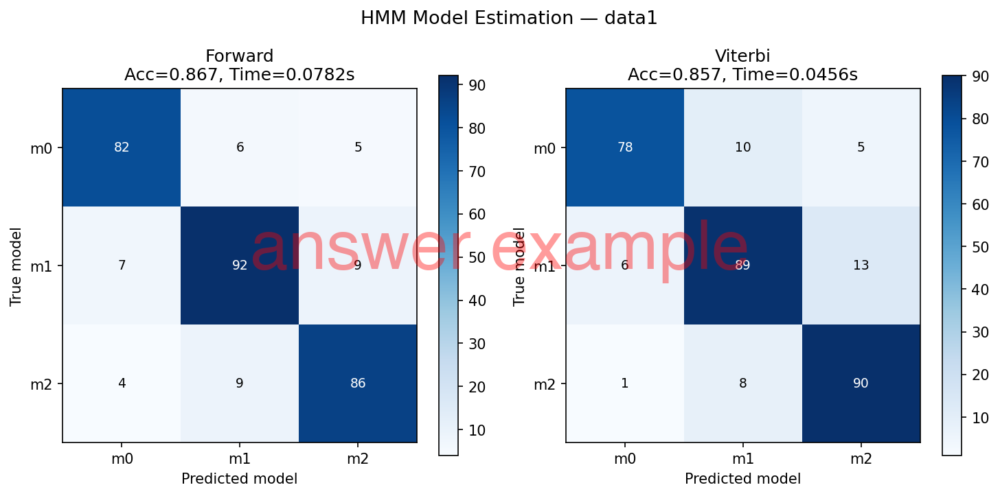
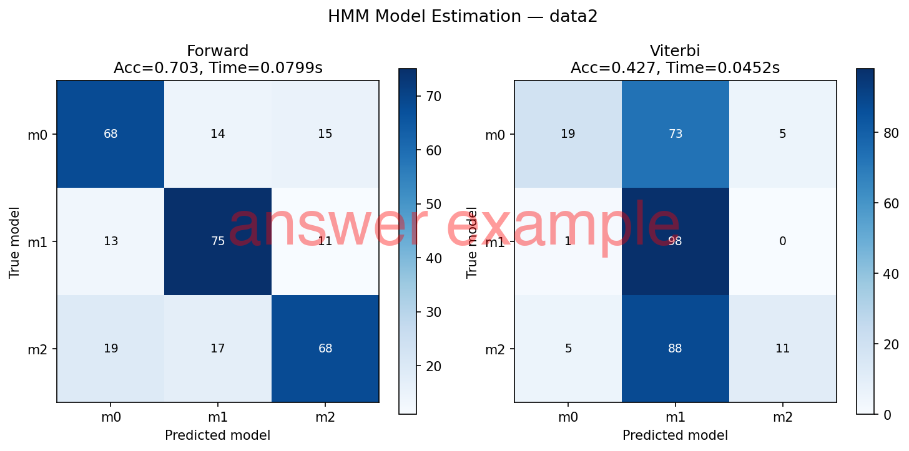

# 第6回B4輪講課題

## 概要

> [!WARNING]
> - 本課題でのコーディングエージェントやAIツールの利用禁止（コンペまではAIツール無しで，考えて実装する力を養成するため）
> - numpyの行列演算を使って実装すること

本課題では，隠れマルコフモデル（HMM）を用いて，出力系列の尤度計算と，各出力系列を生成したモデルの推定を行う．

## データセット `data/` について

- `data1.pickle`：Left-to-Right HMM から生成されたデータ（少数クラス）
- `data2.pickle`：Ergodic HMM から生成されたデータ（少数クラス）
- `data3.pickle`：Left-to-Right HMM から生成されたデータ（多数クラス）
- `data4.pickle`：Ergodic HMM から生成されたデータ（多数クラス）

pickleデータの読み込み方法：

```python
import pickle
data = pickle.load(open("data/data1.pickle", "rb"))
```

### dataの階層構造

```
data
├─ answer_models   # 出力系列を生成したモデル（正解ラベル） [p,]
├─ output          # 出力系列 [p, t]
└─ models          # 定義済みHMM
   ├─ PI           # 初期確率 [k, l, 1]
   ├─ A            # 状態遷移確率行列 [k, l, l]
   └─ B            # 出力確率 [k, l, n]
```

- $k$：モデル数，$l$：状態数，$n$：出力記号数，$p$：出力系列数，$t$：系列長


### 具体的な中身の例（data1 の場合：モデル数 $k=3$，状態数 $l=4$，出力記号数 $n=6$）

- `answer_models = [1, 2, 0, 1, 1, ...]`：出力系列 0 は $m_1$ から，出力系列 1 は $m_0$ から，出力系列 2 は $m_2$ から生成された（ラベルは $0 \sim k{-}1$ の範囲）
- `output[0] = [3, 5, 3, 1, 5, ...]`：出力系列 0 の出力記号列は $o_0, o_4, o_2, o_5, o_1, \ldots$ だった（記号は $0 \sim n{-}1$ の範囲）
- `PI[0] = [[1], [0], [0], [0]]`：$m_0$ の初期状態が $s_0$ である確率が 1，$s_1, s_2, s_3$ は 0（Left-to-Right HMM なので必ず $s_0$ から開始）
- `A[0]`：shape $(l, l) = (4, 4)$ の上三角行列（Left-to-Right の場合），各行の和が 1
```
[[0.27952757 0.15850851 0.31009744 0.25186648]
 [0.         0.05143663 0.53285344 0.41570994]
 [0.         0.         0.85985919 0.14014081]
 [0.         0.         0.         1.        ]]
```
- `B[0]`：shape $(l, n) = (4, 6)$ の行列，各行の和が 1
```
[[0.12312389 0.10136661 0.25335362 0.1760161  0.22492178 0.12121799]
 [0.0741877  0.18105793 0.02083472 0.27020067 0.20622247 0.2474965 ]
 [0.09691564 0.26535664 0.24414969 0.21278423 0.05320777 0.12758604]
 [0.0150052  0.05285263 0.23398182 0.25512198 0.33142527 0.1116131 ]]
```


## 課題

### 6-1 Forwardアルゴリズムによる尤度計算とモデル推定

- Forward アルゴリズムを実装し，各出力系列 $O$ と各モデル $m_k$ に対して尤度 $P(O \mid m_k)$ を計算せよ．
- 尤度が最大となるモデルを推定モデルとして，正解ラベルと比較せよ．
- 混同行列（Confusion Matrix）と正解率（Accuracy）を算出・表示せよ．
- アルゴリズムの計算時間を測定せよ．

### 6-2 Viterbiアルゴリズムによるモデル推定

- Viterbi アルゴリズムを実装し，各出力系列 $O$ と各モデル $m_k$ に対して**最尤状態系列をたどったときの対数確率** $\log P^*(O \mid m_k)$ を計算せよ．
- この対数確率をモデルごとのスコアとして用い，スコアが最大となるモデルを「その出力系列を生成したモデル」として推定せよ．
- 混同行列（Confusion Matrix）と正解率（Accuracy）を算出・表示せよ．
- アルゴリズムの計算時間を測定せよ．
- 最尤状態系列を示せ．


### 6-3 性能比較

- ForwardアルゴリズムとViterbiアルゴリズムの結果（正解率，計算時間）を比較・考察せよ．
- data1〜data4 の各データセットで実験を行い，Left-to-Right HMM と Ergodic HMM に対する両アルゴリズムの振る舞いの違いについて考察せよ．


## 出力例
`data/data1.pickle`, `data/data2.pickle` に対して Forward, Viterbi アルゴリズムを実行した結果を以下に記載．





## アルゴリズムの概要

### Forwardアルゴリズム

前向き確率 $\alpha_t(i)$ を以下のように定義する：

$$\alpha_t(i) = P(o_1, o_2, \ldots, o_t, q_t = s_i \mid \lambda)$$

**初期化：**
$$\alpha_1(i) = \pi_i b_i(o_1)$$

**漸化式：**
$$\alpha_{t+1}(j) = \left[\sum_{i=1}^{N} \alpha_t(i) a_{ij}\right] b_j(o_{t+1})$$

**尤度：**
$$P(O \mid \lambda) = \sum_{i=1}^{N} \alpha_T(i)$$

### Viterbiアルゴリズム

最大確率 $\delta_t(i)$ を以下のように定義する：

$$\delta_t(i) = \max_{q_1,\ldots,q_{t-1}} P(q_1,\ldots,q_{t-1}, q_t=s_i, o_1,\ldots,o_t \mid \lambda)$$

**初期化：**
$$\delta_1(i) = \pi_i b_i(o_1)$$

**漸化式（対数域での計算を推奨）：**
$$\delta_{t+1}(j) = \max_i \left[\delta_t(i) a_{ij}\right] b_j(o_{t+1})$$

**最適パスの確率：**
$$P^* = \max_i \delta_T(i)$$

> [!TIP]
> アンダーフロー対策として，対数スケール（log-domain）での計算を推奨する．

## 発展課題（余裕がある人向け）

- numpy の行列演算を積極的に活用し，for ループを削減して高速化を試みよ
- スケーリング法（scaling factor）による Forward アルゴリズムのアンダーフロー対策を実装せよ
- 異なる系列長・モデル数でのスケーラビリティを評価せよ

## 発表（次週）

- 取り組んだ内容を周りにわかるように説明
- コードの解説
    - 工夫したところ，苦労したところの解決策はぜひ共有しましょう
- 結果の考察，応用先の調査など
- 発表資料は nas01 の `internal/発表資料/B4輪講/2026/第6回` へアップロードしておくこと

## 注意

- 自分の作業ブランチで課題を行うこと
- プルリクエストをおくる際には**実行結果の画像ファイルも載せること**
- プルリクエストのコメントには，結果を作るために実行したコマンドも書くこと
- 作業前にリポジトリを最新版に更新すること

```bash
$ git checkout main
$ git fetch upstream
$ git merge upstream/main
```
