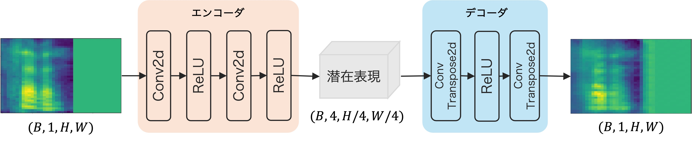

# 戸田研究室サーバの使い方

## 1. サーバへの接続

### 1.1 SSH鍵の作成

自分のPCで以下のコマンドを実行して、SSH鍵を作成してください。

```bash
ssh-keygen -t ed25519
```

### 1.2 SSH公開鍵の登録

1. [公開鍵登録システム](https://keymgr.toda.is.i.nagoya-u.ac.jp/app/login.php)にアクセス
2. ユーザ名、パスワードを入力してログイン
3. 「+追加」ボタンから作成した公開鍵（末尾`.pub`）を登録

### 1.3 `~/.ssh/config`の修正

以下の内容を自分のPCの`~/.ssh/config`に追加してください。

```bash
Host lab-compute01
    HostName compute01.toda.is.i.nagoya-u.ac.jp
Host lab-compute02
    HostName compute02.toda.is.i.nagoya-u.ac.jp
# compute03以降も同様に追加

Host lab-*
    User <your_username>
    IdentityFile ~/.ssh/id_ed25519
```

> [!NOTE]
> 戸田研究室のサーバ一覧は[こちら](https://www.notion.so/todalab/Compute-servers-2fb158d5581f477ca0a84ef1c191c214)です。

### 1.4 サーバへの接続

自分のPCから以下のコマンドでサーバに接続できます。

```bash
ssh lab-compute01
```

## 2. NASのマウント

1. 自分のPCから利用したい全てのNASの[Web GUI](https://nas01.toda.is.i.nagoya-u.ac.jp:5001/)にログイン
2. サーバ上で以下のコマンドを実行

    ```bash
    update-nashome-symlinks
    ```

> [!IMPORTANT]
> 利用したい全てのサーバ上で、上記のコマンドを実行してください。

> [!NOTE]
> 戸田研究室のNAS一覧は[こちら](https://www.notion.so/todalab/NAS-Network-Attached-Storage-5d56960aed2744f0a1e5e00f73798578)です。

## 3. サーバの利用

戸田研究室では、ジョブ管理システムとしてSlurmを使用しています。研究でよく使うSlurmコマンドは以下の通りです。

- `sbatch`：ジョブを投げるためのコマンド
- `srun`：インタラクティブにジョブを投げるためのコマンド
- `squeue`：ジョブの状態を確認するためのコマンド
- `scancel`：ジョブをキャンセルするためのコマンド
- `sinfo`：ノードの状態を確認するためのコマンド

> [!NOTE]
> より詳しいSlurmの使い方については、[こちら](https://www.notion.so/todalab/Slurm-1eb11a8a9d7c4dfc928a75a35a91e6f3)を参照してください。

### 3.1 研究室サーバ利用マナー

- 必ずSlurmを使用してジョブを投げる
- 大量のジョブを一度に並列投入しない
- 長時間の占有を避ける
- Slackの`#server-negotiate`を活用する

### 3.2 実行例

sbatchを使用してジョブを投げる
---

まず、実行したいジョブのシェルスクリプトを作成してください。基本的には、`run.sh`の中に`#!/bin/bash`と実行したいコマンドを書くだけで問題ありません。例えば、以下のような内容になります。

```bash
#!/bin/bash
#SBATCH --job-name=server-lecture   # ジョブ名
#SBATCH --nodes=1                   # 使用ノード数
#SBATCH --gres=gpu:1                # GPU数
#SBATCH --time=1-00:00:00           # 使用時間

uv run src/train.py -m
```

> [!TIP]
> ファイル内でパラメータをあらかじめ指定できます。これらのパラメータは、コマンドライン引数で上書きできます。

以下のようなコマンドを実行することで、ジョブを投げられます。

```bash
sbatch -t 1-00:00:00 ./run.sh
```

> [!TIP]
> よく使うパラメータ一覧
> 
> | パラメータ    | 説明         |
> |-------------|-------------|
> | `-t` | 実行時間上限を設定します。`dd-hh:mm:ss`のように指定します。**（必須）** |
> | `-w` | 使用したいノードを設定します。 |
> | `-x` | 使用したくないノードを設定します。 |
> | `-o` | ログの出力先を設定します。 |
> | `--gres` | 使用するGPU数を設定します。`gpu:1` のように設定します。 |
> 
> <details>
> <summary>実行例</summary>
> 
> - ノードを指定したい場合
>     ```bash
>     sbatch -w mrcompute02 -t 1-00:00:00 ./run.sh
>     ```
> - 特定のノードを使用したくない場合
>     ```bash
>     sbatch -x compute01,compute02 -t 1-00:00:00 ./run.sh
>     ```
> - 出力先を指定したい場合
>     ```bash
>     sbatch -o output.log -t 1-00:00:00 ./run.sh
>     ```
> - 複数のGPUを使用したい場合
>     ```bash
>     sbatch --gres=gpu:2 -t 1-00:00:00 ./run.sh
>     ```
> 
> </details>


srunを使用してインタラクティブにジョブを投げる
---

コードを書いている途中でGPU上でデバッグしたい場合などは、`srun`を使用してインタラクティブにジョブを投げることができます。
以下のようなコマンドを実行することで、インタラクティブにジョブを投げられます。

```bash
srun --gres=gpu:1 -t 1-00:00:00 --pty bash
```

squeueを使用してジョブの状態を確認する
---

以下のようなコマンドを実行することで、ジョブの状態を確認できます。

```bash
squeue

# 自分のジョブの状態を確認する場合
squeue -u <your_username>
```

scancelを使用してジョブをキャンセルする
---

以下のようなコマンドを実行することで、ジョブをキャンセルできます。

```bash
scancel <job_id>
```

## 4. 演習

### 4.1 仮想環境の構築

ここでは、[uv](https://docs.astral.sh/uv/)を使用した仮想環境の構築方法について説明します。

#### 4.1.1 uvのインストール

サーバ上で以下のコマンドを実行して、uvをインストールしてください。

```bash
curl -LsSf https://astral.sh/uv/install.sh | UV_INSTALL_DIR=$HOME/nas01home/linux/uv sh
```

> [!IMPORTANT]
> NAS上のディレクトリにインストールしてください。

#### 4.1.2 `~/.bashrc`の修正

以下の内容をサーバ上の`~/.bashrc`に追加してください。

```bash
export UV_PYTHON_INSTALL_DIR="$HOME/nas01home/linux/uv/python"
export UV_CACHE_DIR="$HOME/nas01home/linux/uv/cache"
```

### 4.2 準備

#### 4.2.1 リポジトリのクローン

サーバ上で以下のコマンドを実行して、本リポジトリをクローンしてください。

```bash
git clone https://github.com/todalab/server-lecture.git
```

#### 4.2.2 仮想環境の構築

サーバ上で以下のコマンドを実行して、仮想環境を構築してください。

```bash
cd server-lecture
uv sync
```

#### 4.2.3 データセットのダウンロード

サーバ上で以下のコマンドを実行して、今回使用するデータセット（[Free Spoken Digit Dataset: FSDD](https://github.com/Jakobovski/free-spoken-digit-dataset)）をダウンロードしてください。

```bash
cp -r //nas01/internal/発表資料/B4輪講/2026/server-lecture/data ./data
```

### 4.3 Torch + CUDAによるシンプルなモデルの実装

`answer`ブランチに実装例があるので、それを参考にして実装してください。実装するモデルは音声のメルスペクトログラムを入力として、入力と同じメルスペクトログラムを出力するオートエンコーダーです。以下のような構成になります。



#### 4.3.1 Dataset・Dataloaderの実装

**対象ファイル:** `./src/dataloaders/dataloader.py`

`MelSpectrogramDataset`クラスの`__getitem__`を実装してください。

- 音声ファイルを読み込み、`self.sample_rate`でリサンプリングする
- 波形を `(1, T)` の形状の Tensor に変換する
- メルスペクトログラムを計算し、dBスケールに変換する
- フレーム数を `target_frames` に揃える
- `(mel, digit, name)` のタプルを返す

`create_dataloader()`関数に`DataLoader`の生成を実装してください。

- 作成した`dataset`から`DataLoader`を作成する
- 再現性のため、`generator=generator`、`worker_init_fn=seed_worker`を渡す

#### 4.3.2 モデルの実装

**対象ファイル:** `./src/models/autoencoder.py`

`Encoder`クラスの`self.net`にエンコーダーのネットワークを実装してください。

- stride=2の畳み込みを2段重ねて、空間解像度を1/4に落とす
- 各畳み込み層の後に`ReLU`を挟む

`Encoder`クラスの`forward()`関数に順伝播を実装してください。

- 入力を作成したネットワークに通す

#### 4.3.3 Backwardによるバックプロパゲーション

**対象ファイル:** `./src/train.py`

`train()`関数内のバッチループに学習ステップを実装してください。

- 勾配をリセットする
- 順伝播で再構成メルスペクトログラムを得る
- 損失を計算する
- 誤差逆伝播を行う
- パラメータを更新する

### 4.4 ジョブ実行

コードの実装が完了したら、以下のようなコマンドを実行して、ジョブを投げてください。

```bash
sbatch -o output.log -t 1-00:00:00 ./jobs/run_train.sh
```

`./output.log`にログが出力されるので、適宜確認してください。
学習成功すれば、`./logs/mel_ae/`に設定ファイル、モデルの重み、TensorBoardのログ、loggingのログなどが保存されるはずです。

### 4.5 研究において便利なライブラリ

#### 4.5.1 環境構築

**主要なツール**
- [uv](https://docs.astral.sh/uv/)
- [pyenv](https://github.com/pyenv/pyenv)
- [Anaconda / Miniconda](https://www.anaconda.com/)
- [Poetry](https://python-poetry.org/)

本リポジトリでは、uvを使用して環境構築を行っています。
よく使うコマンドは以下の通りです。

```bash
uv init              # 新規プロジェクトの作成
uv sync              # 環境の同期
uv add <package>     # packageのインストール
uv remove <package>  # packageのアンインストール
uv run <command>     # コマンドの実行
```

#### 4.5.2 コードの静的解析・整形

**主要なツール**
- [Ruff](https://docs.astral.sh/ruff/)
- [mypy](https://mypy-lang.org/)
- [ty](https://docs.astral.sh/ty/)

本リポジトリでは、Ruffとtyを使用してコードの静的解析・整形を行っています。
以下のようなコマンドを実行することで、コードの静的解析・整形を行えます。

```bash
uv run ruff format ./src/       # コードの整形
uv run ruff check --fix ./src/  # コードの静的解析と自動修正
uv run ty check ./src/          # コードの静的型チェック
```

> [!TIP]
> Visual Studio CodeなどのエディタでRuffの拡張機能をインストールすることで、コードの静的解析・整形を自動化することができます。

> [!NOTE]
> 本リポジトリでは、[poethepoet](https://poethepoet.natn.io/index.html)を利用することで`uv run poe check`コマンドを実行するだけで、コードの整形、静的解析、型チェックを一括で行えるようにしています。

#### 4.5.3 実験管理・可視化

**主要なツール**
- [TensorBoard](https://www.tensorflow.org/tensorboard)
- [Weights & Biases](https://wandb.ai/site)
- [MLflow](https://mlflow.org/)

本リポジトリでは、TensorBoardを使用して実験管理・可視化を行っています。
`./logs/`以下に学習ログが保存されているので、以下のコマンドを実行した後、ブラウザで`http://localhost:<port_number>/`を開くと、TensorBoardのダッシュボードが表示されます。

```bash
uv run tensorboard --logdir ./logs/ --port <port_number>
```

> [!NOTE]
> Visual Studio Codeなどのリモート開発環境を使用している場合、ポートフォワーディングの都合で指定したポート番号と異なる場合があります。

#### 4.5.4 モデル設定管理

**主要なツール**
- [Hydra](https://hydra.cc/)
- [OmegaConf](https://omegaconf.readthedocs.io/en/2.3_branch/)

本リポジトリでは、Hydraを使用してモデル設定管理を行っています。`./configs/`ディレクトリに実験で使用するパラメータがYAML形式で保存されています。
さらにHydraでは、`MULTIRUN`モードを使用することで、複数のパラメータを一括で変更して実験を行うことができます。

#### 4.5.5 ハイパーパラメータチューニング

**主要なツール**
- [Optuna](https://optuna.readthedocs.io/en/stable/)
- [Hyperopt](https://hyperopt.github.io/hyperopt/)

本リポジトリの`./src/train_optuna.py`では、Optunaを使用してハイパーパラメータチューニングを行っています。`hydra-optuna-sweeper`を使用することで、Hydraの設定ファイルを使ってOptunaでハイパーパラメータチューニングを行えます。
