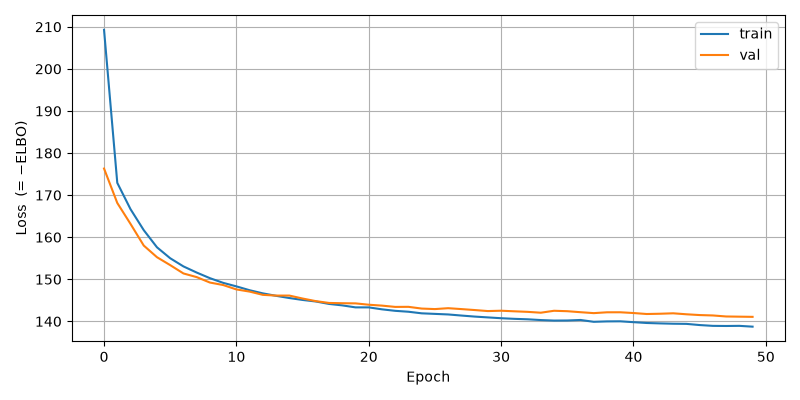
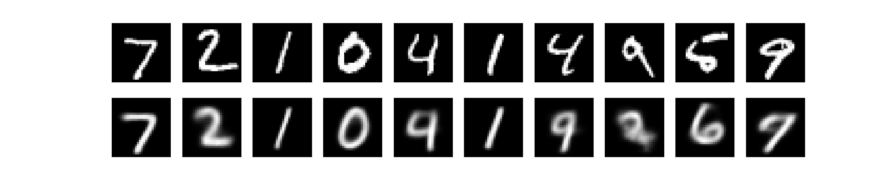
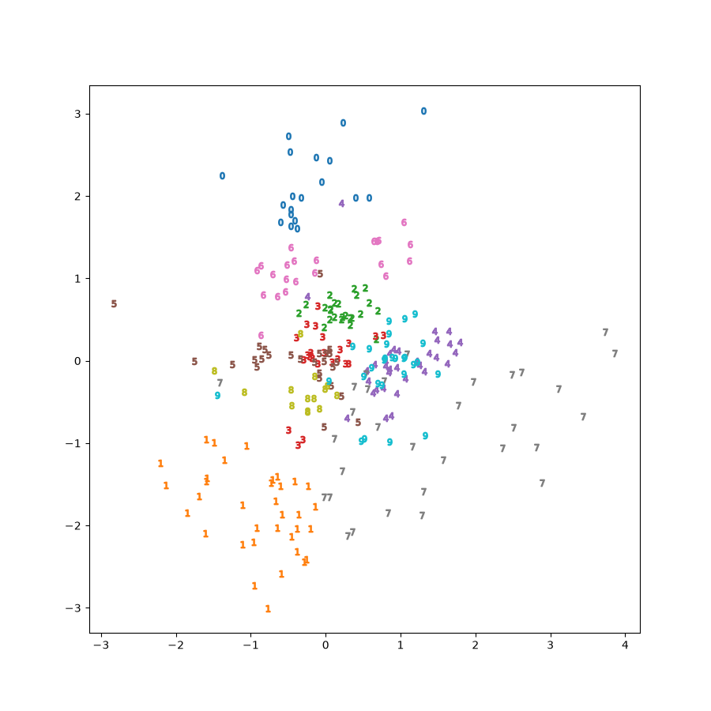
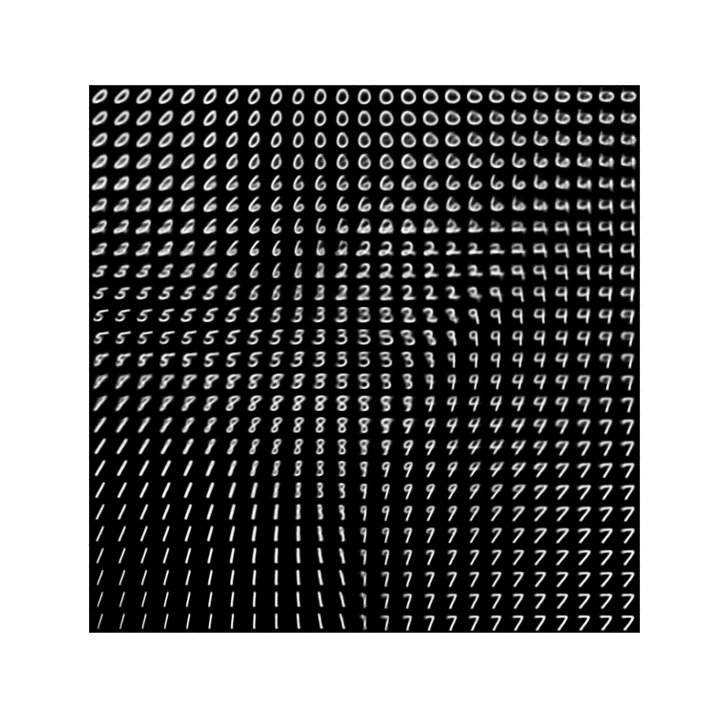
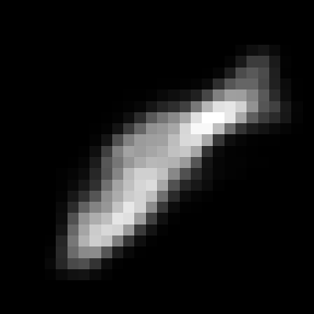

# 第7回B4輪講課題 — 変分自己符号化器（VAE）

## 概要

> [!NOTE]
> - 本課題では**AIツールの使用を許可**します（コンペ後のため、効率的な学習を重視）
> - ただし、変分推論の核心部分は自分で理解して実装すること
> - PyTorchの基本機能のみを使用し、高レベルの VAE ライブラリは使用禁止（`pythae` 等の専用ライブラリを含む）
> - KL ダイバージェンスは **[Auto-Encoding Variational Bayes](https://arxiv.org/abs/1312.6114) Appendix B の解析解を自ら実装すること**（`torch.distributions.kl_divergence()` による自動計算は禁止）
> - Reparametrization trick は **同論文 Section 2.4 の式を自ら実装すること**（`torch.distributions.Normal(...).rsample()` 等の高レベル API による自動微分サポートは禁止）

本課題では **Variational Autoencoder (VAE)** を実装し、**MNIST 手書き数字データセット**を用いて画像生成タスクを行う。  
変分推論の枠組みから導出される ELBO（変分下限）を損失関数として、潜在空間の学習・サンプリング・生成を体験することを目的とする。

---

## 背景・課題設定

深層学習における生成モデルは、データの確率的な構造を学習し、新たなサンプルを生成することを目的としており、画像・テキスト・音声・音楽の生成タスクに用いられる。しかし、観測データから潜在変数の真の事後分布を直接求めることは、一般に計算量的に困難である。

**Variational Autoencoder（VAE; Kingma & Welling, 2014）** は、この問題を**変分推論**の枠組みで解決する。近似事後分布を導入して真の事後分布を近似し、**ELBO（変分下限）** を最大化することで Encoder と Decoder を同時に学習する。生成モデルでありながら決定論的なニューラルネットワークで学習できる点が特徴である。

### **学習目標**

1. **変分推論が必要な理由を説明できる**
2. **VAE における ELBO の意味と、損失関数の導出を説明できる**
3. **Reparametrization trick とその性質について説明できる**

---

## 前準備

```bash
pip install -r requirements.txt
```

---

## データセット

**MNIST（Modified National Institute of Standards and Technology database）**

- 手書き数字（0〜9）の 28×28 グレースケール画像
- 訓練データ: 60,000 枚、テストデータ: 10,000 枚
- `torchvision.datasets.MNIST` から初回実行時に自動ダウンロード

---

## 課題

### 7-1 VAE の実装

`VAEs/VAE-skeleton.py` 内の `#TODO` を埋めて、以下の関数を完成させてください。  
各項の参照先にある数式を読み取り、実装に反映させてください。  
※ 完成後、`raise NotImplementedError` を削除することを忘れないでください。

#### **7-1-1 `encoder(self, x)`**

[Auto-Encoding Variational Bayes](https://arxiv.org/abs/1312.6114) の **Appendix C.1** を参照。  
入力画像 $x$ を全結合層に通して、潜在変数の**平均 $\mu$** と**対数分散 $\log\sigma^2$** を返す。

#### **7-1-2 `sample_z(self, mean, log_var)`**

同論文の **Section 2.4、Eq. (4)** を参照。  
Reparametrization trick を用いて潜在変数 $z$ をサンプリングする。  
`torch.distributions.Normal(...).rsample()` の使用は禁止。論文の式を自力で実装すること。

#### **7-1-3 `decoder(self, z)`**

同論文の **Appendix C.1** を参照。  
潜在変数 $z$ から再構成画像 $\hat{x} \in [0,1]$ を生成する（最終層は Sigmoid）。

#### **7-1-4 `kld(self, mean, log_var)`**

同論文の **Appendix B** を参照。  
$q(z|x) = \mathcal{N}(\mu, \sigma^2 I)$、$p(z) = \mathcal{N}(0, I)$ のときの KL ダイバージェンスは閉形式で解ける。  
`torch.distributions.kl_divergence()` の使用は禁止。論文の式を自力で実装すること。

#### **7-1-5 `forward(self, x)`**

同論文の **Eq. (3)** を参照。  
encoder → sample_z → decoder の順に呼び出し、`self.kld()` で KL 項を、ベルヌーイ対数尤度で再構成誤差を計算して返す。  
学習時の損失は ELBO の符号を反転して最小化する（スケルトンのコメントを参照）。

`forward` は `[elbo_kl, elbo_rec], z, y` を返す。

---

### 7-2 再現性の確保

提供されている `main.py` を実行すると、毎回異なる結果が得られます。  
**なぜ再現性がないのか**を考え、再現性を確保するための修正を施してください。

---

### 7-3 ハイパーパラメータの実験（任意）

以下のハイパーパラメータを変えて、結果の変化を観察してください。

| 引数 | デフォルト | 説明 |
|------|-----------|------|
| `--z_dim` | 2 | 潜在変数の次元数 |
| `--h_dim` | 400 | 中間層の次元数 |
| `--drop_rate` | 0.2 | Dropout 率 |
| `--lr` | 0.001 | 学習率 |

---

## 実装仕様

### **提供ファイル**

| ファイル | 内容 |
|----------|------|
| `VAE_skeleton.py` | 実装箇所（`#TODO`）が明示された 穴あきのVAE |
| `test_implementation.py` | 実装を確認するためのテストコード |
| `libs/Visualize.py` | 可視化クラス（実装済み・変更不要） |
| `main.py` | 学習・可視化スクリプト（実装済み・変更不要） |
| `requirements.txt` | 依存ライブラリ |

### **実行コマンド**

```bash
# デフォルト設定で実行
python main.py

# ハイパーパラメータを指定
python main.py --z_dim 2 --h_dim 400 --drop_rate 0.2 --lr 0.001 --epochs 100

# オプション一覧
python main.py --help

# テストの実行
python test_implementation.py
```

---

## 実験設定

### **デフォルトハイパーパラメータ**

```python
# main.py のデフォルト値
Z_DIM      = 2      # 潜在変数の次元数
H_DIM      = 400    # 中間層の次元数
DROP_RATE  = 0.2    # Dropout 率
LR         = 1e-3   # 学習率
EPOCHS     = 100    # 最大エポック数
BATCH_SIZE = 256    # バッチサイズ
TRAIN_RATE = 0.8    # 訓練 60,000 枚の分割割合（残り 0.2 = 12,000 枚が検証データ、テストデータは別途 10,000 枚）
PATIENCE   = 10     # Early stopping の patience
```

---

## 出力例

### **学習ログ（z_dim=2, h_dim=400, epochs=50）**

```
Device: cuda
[Epoch   1]  train:   53570.9  val:   45001.6
[Epoch   2]  train:   43766.7  val:   42188.3
[Epoch   3]  train:   42139.3  val:   41070.7
[Epoch   5]  train:   40263.1  val:   39595.1
[Epoch  10]  train:   38517.7  val:   38147.3
[Epoch  20]  train:   37240.0  val:   37026.7
[Epoch  30]  train:   36560.3  val:   36545.1
[Epoch  40]  train:   36189.2  val:   36314.2
[Epoch  50]  train:   35906.5  val:   36078.6
Loss curve → ./images/loss_curve.png
```



### **再構成結果（上段：入力、下段：再構成）**



### **潜在空間（z_dim=2、数字ラベルで色分け）**



### **格子点からの生成（z_dim=2）**



### **潜在空間の補間 GIF（z_dim=2）**



### **生成されるファイル**

| パス | 内容 |
|------|------|
| `images/loss_curve.png` | 訓練・検証 Loss の推移グラフ |
| `images/reconstruction/` | 入力画像と再構成画像の比較 |
| `images/latent_space/` | 潜在空間の散布図（クラスごとに色分け） |
| `images/lattice_point/` | 格子点からの生成画像（`z_dim=2` のみ） |
| `images/walkthrough/` | 潜在空間の補間 GIF（`z_dim=2` のみ） |

---

## 発展課題（任意）

- **高次元潜在空間の可視化**: `--z_dim` を 3 以上にして、t-SNE や PCA で潜在空間を可視化する
- **別データセット**: FashionMNIST など別の画像データセットに差し替える
- **音声への応用**: VAE は音声分野でも活用されている。例えば VAE-SiFiGAN（Kenichi Ogita; Reo Yoneyama; Wen-Chin Huang; Tomoki Toda, EUPISCO 2025）は VAE を用いた高品質音声合成ボコーダである。戸田研のGithubにある[ソースコード](https://github.com/todalab/ogita23_codes#)を読んで、本課題で学んだ潜在変数モデルの考え方がどのように応用されているか調べてみよう。

---

## 発表内容（次週）

1. **実装した VAE の説明**
   - Encoder・Decoder の構造
   - ELBO の意味と損失関数の導出
   - Reparametrization trick の必要性

2. **実験結果**
   - Loss の推移（収束の様子）
   - 再構成結果・潜在空間の可視化
   - 再現性の問題とその修正内容

3. **考察**
   - 潜在空間の構造から読み取れること
   - MNISTをVAEで学習すると，出力結果がぼやけたようなものになる理由
   ※ 他の解説サイトの結果でも軒並みぼやけた出力がされます。VAEにそういった特徴があると考えられます。
   - ハイパーパラメータを変えたときの変化（任意）

---

## 注意事項

- 自分の作業ブランチで課題を行うこと
- プルリクエストを送る際には **Loss 推移グラフと生成結果の画像を載せること**
- 作業前にリポジトリを最新版に更新すること

```bash
git checkout main
git fetch upstream
git merge upstream/main
```

---

## 参考文献

- [Auto-Encoding Variational Bayes](https://arxiv.org/abs/1312.6114) — Kingma & Welling (2014)：VAE の原論文
- [Tutorial on Variational Autoencoders](https://arxiv.org/abs/1606.05908) — Doersch (2016)：変分推論の直感的な解説
