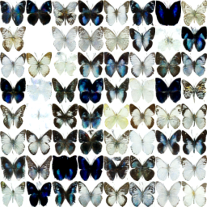

# 第8回B4輪講課題 — 拡散モデル（Diffusion Model）

## 概要

> [!NOTE]
> - 本課題では**AIツールの使用を許可**します（コンペ後のため、効率的な学習を重視）
> - ただし、拡散モデルの核心部分は自分で理解して実装すること
> - PyTorchの基本機能のみを使用し、`diffusers` ライブラリの高レベルなスケジューラ・パイプラインは使用禁止
> - 順拡散過程・逆拡散過程は **[Denoising Diffusion Probabilistic Models](https://arxiv.org/abs/2006.11239) の数式を自ら実装すること**（`diffusers.DDPMScheduler` 等による自動計算は禁止）

本課題では **DDPM（Denoising Diffusion Probabilistic Models）** を実装し、**Smithsonian Butterflies データセット**を用いて蝶の画像を生成するタスクを行う。  
順拡散過程・逆拡散過程の数理的枠組みを理解したうえで、ノイズ推定（スコア推定）と損失関数の関係を考察することを目的とする。

---

## 背景・課題設定

拡散モデルは、2020年以降の画像生成分野で急速に発展し、現在では Stable Diffusion・DALL-E 3・Imagen などの最先端システムの基礎となっている。その中心にあるのが **DDPM（Ho et al., 2020）** であり、データに段階的にガウスノイズを加える「順拡散過程」と、ノイズから元データを復元する「逆拡散過程」を学習するモデルである。

VAEとの大きな違いは、潜在空間を明示的に定義せず、データ空間上で拡散・復元を行う点にある。DDPM の学習目標は、各タイムステップで加えたノイズ自体を予測するニューラルネットワークの訓練であり、この「ノイズ推定」は**スコア関数**（データ分布の対数尤度の勾配 $\nabla_x \log p(x)$）の推定と深く結びついている。

### **学習目標**

1. **Diffusion の基本的なアイデアと Forward/Reverse Process について説明できる**
2. **スコアとスコア推定の意味を説明できる**
3. **スコア推定・損失関数・MSE 最小化の3つの関係とその理由を説明できる**

---

## 前準備

```bash
pip install -r requirements.txt
```

---

## データセット

**Smithsonian Butterflies Subset**（HuggingFace Datasets）

- 蝶の写真 約1,000枚のカラー画像
- 初回実行時に HuggingFace から自動ダウンロード
- ダウンロード先を `datadir` 引数で指定する

---

## 課題

### 8-1 DiffusionModel の実装

`diffusion_skeleton.py` 内の `#TODO` を埋めて、以下の3つのメソッドを完成させてください。  
各メソッドの参照先にある数式・アルゴリズムを読み取り、実装に反映させてください。  
※ 完成後、`raise NotImplementedError` を削除することを忘れないでください。

#### **8-1-1 `q_sample(self, x0, t, noise=None)`**

[Denoising Diffusion Probabilistic Models](https://arxiv.org/abs/2006.11239) の **Eq. (4)** を参照。  
クリーン画像 $x_0$ に $t$ ステップ分のノイズを一括で加え、$x_t$ を計算する（閉形式サンプリング）。

$$x_t = \sqrt{\bar{\alpha}_t}\, x_0 + \sqrt{1 - \bar{\alpha}_t}\, \varepsilon, \quad \varepsilon \sim \mathcal{N}(0, I)$$

ここで $\bar{\alpha}_t = \prod_{s=1}^{t} \alpha_s$ は `self.alpha_prod[t]` に登録済みである。

#### **8-1-2 `p_sample(self, x, t)`**

同論文の **Algorithm 2** および **Eq. (11)** を参照。  
ノイズ付き画像 $x_t$ から、推定ノイズ $\varepsilon_\theta$ を用いて $x_{t-1}$ を 1ステップ計算する。  
`self.alpha[t]` ($\alpha_t$) および `self.alpha_prod[t]` ($\bar{\alpha}_t$) を使うこと。  
$t = 0$ のとき（最終ステップ）はノイズを加えないことに注意。

#### **8-1-3 `training_step(self, batch, batch_idx)`**

同論文の **Algorithm 1** を参照。  
ランダムなタイムステップ $t \sim \text{Uniform}\{0, T-1\}$ をサンプリングし、  
`q_sample` でノイズ付き画像を生成して `forward` で推定、損失を計算して返す。  
損失は `self.log("train_loss", loss, prog_bar=True)` でログに記録すること。

#### **8-1-4 学習の確認と生成**

実装が完了したら、以下の手順で動作を確認してください。

1. **損失関数の推移を確認する**: TensorBoard で `train_loss` が単調に減少していることを確認する
2. **画像を生成する**: TensorBoard の「Images」タブで、エポックごとの生成画像の変化を確認する
3. **（発展）Diffusion process のアニメーション**: $x_T \to x_0$ の逆拡散過程を各ステップで可視化し、GIF アニメーションとして保存するとより良い（`generate` 関数の中間結果を保存する方法を考えてみよう）

---

### 8-2 様々な改善にトライ（任意）

8-1 の基本実装が動いたら、以下の改善を試してみてください。変更ごとに結果を比較し、考察してみましょう。

#### **ノイズ推定モデルの変更**

`conf/default.yaml` の `model` セクションを変えて、UNet のアーキテクチャを変える。

```yaml
model:
  block_out_channels:
    - 64    # → 128 → 256 など、チャネル数を増やして表現力を上げる
    - 128
    - 256
```

#### **ノイズスケジューリングの変更**

線形スケジュール（`linear`）以外に、コサインスケジュール（Nichol & Dhariwal, 2021）を実装して比較する。

```yaml
diffusion:
  noise_schedule: linear   # → cosine に変更して実装
  noise_schedule_kwargs:
    start: 0.0001
    end: 0.02
```

#### **学習・推論のタイムステップの変更**

タイムステップ数 $T$ を変えると学習・推論の精度・速度が変化する。

```yaml
diffusion:
  num_timesteps: 1000   # → 500, 200 など
```

また、推論時のステップ数を学習時より少なくする（サブサンプリング）ことで、高速生成ができるか試してみよう（DDIM の考え方）。

---

## 実装仕様

### **提供ファイル**

| ファイル | 内容 |
|----------|------|
| `diffusion_skeleton.py` | 実装箇所（`#TODO`）が明示された DiffusionModel クラス |
| `main.py` | 訓練ループ・可視化スクリプト（実装済み・変更不要） |
| `conf/default.yaml` | Hydra 設定ファイル（ハイパーパラメータ） |
| `requirements.txt` | 依存ライブラリ |

### **実行コマンド**

```bash
# データダウンロード先を指定して実行（初回はダウンロードが走る）
python main.py datadir=<データを保存するディレクトリの絶対パス>

# エポック数などを上書きして実行
python main.py datadir=/path/to/data train.num_epochs=100

# 設定一覧の確認
python main.py --help
```

学習ログは TensorBoard で確認できます。

```bash
tensorboard --logdir outputs/
```

---

## 実験設定

### **デフォルトハイパーパラメータ**

```yaml
diffusion:
  num_timesteps: 1000       # タイムステップ数 T
  noise_schedule: linear    # 線形ノイズスケジュール
  noise_schedule_kwargs:
    start: 0.0001           # β_1（β の最小値）
    end: 0.02               # β_T（β の最大値）

train:
  batch_size: 256
  num_epochs: 500

optimizer:
  lr: 1e-3
```

---

## 出力例

### **生成画像（Epoch 500, 8×8 サンプル）**



### **生成されるファイル**

| パス | 内容 |
|------|------|
| `outputs/<日時>/model.pth` | 訓練済みモデルの重み |
| `outputs/<日時>/tensorboard/` | TensorBoard ログ（損失・生成画像） |

---

## 発表内容（次週）

1. **実装した DiffusionModel の説明**
   - Forward Process（q_sample）の数式と実装
   - Reverse Process（p_sample）の数式と実装
   - 学習アルゴリズム（training_step）の流れ

2. **スコアとスコア推定の説明**
   - スコア関数 $\nabla_x \log p(x)$ の意味
   - スコア推定・DDPM の損失関数・MSE 最小化の3つがどのように結びついているか

3. **実験結果**
   - 損失の推移（train_loss の収束の様子）
   - 生成画像（静止画、できれば逆拡散過程のアニメーション）

4. **考察**
   - 生成画像の品質についての評価
   - 改善を試みた場合はその結果と考察（任意）
   - VAE（第7回）との比較（生成品質・学習の仕組みの違い）（任意）

---

## 注意事項

- 自分の作業ブランチで課題を行うこと
- プルリクエストを送る際には**生成画像と損失の推移を載せること**
- 作業前にリポジトリを最新版に更新すること

```bash
git checkout main
git fetch upstream
git merge upstream/main
```

---

## 参考文献

- [Denoising Diffusion Probabilistic Models](https://arxiv.org/abs/2006.11239) — Ho et al. (2020)：DDPM の原論文
- [Generative Modeling by Estimating Gradients of the Data Distribution](https://arxiv.org/abs/1907.05600) — Song & Ermon (2019)：スコアマッチングによる生成モデル
- [Improved Techniques for Training Score-Based Generative Models](https://arxiv.org/abs/2006.09011) — Song & Ermon (2020)：スコア推定の改善
- [Improved Denoising Diffusion Probabilistic Models](https://arxiv.org/abs/2102.09672) — Nichol & Dhariwal (2021)：コサインスケジュールの提案
- [Denoising Diffusion Implicit Models](https://arxiv.org/abs/2010.02502) — Song et al. (2021)：高速サンプリング手法 DDIM
- [The Annotated Diffusion Model](https://huggingface.co/blog/annotated-diffusion) — HuggingFace Blog：DDPM のコード解説
