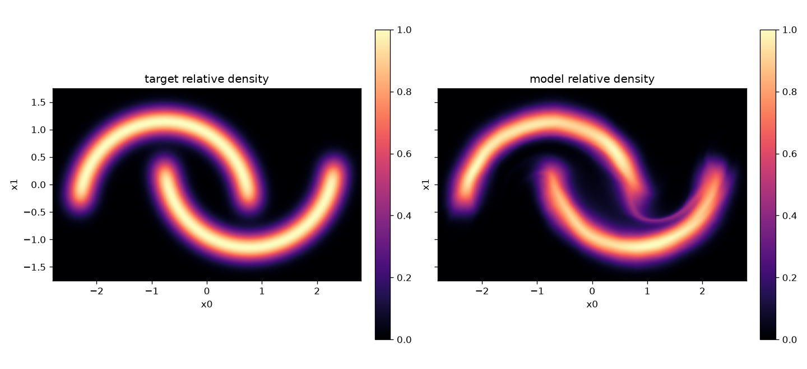
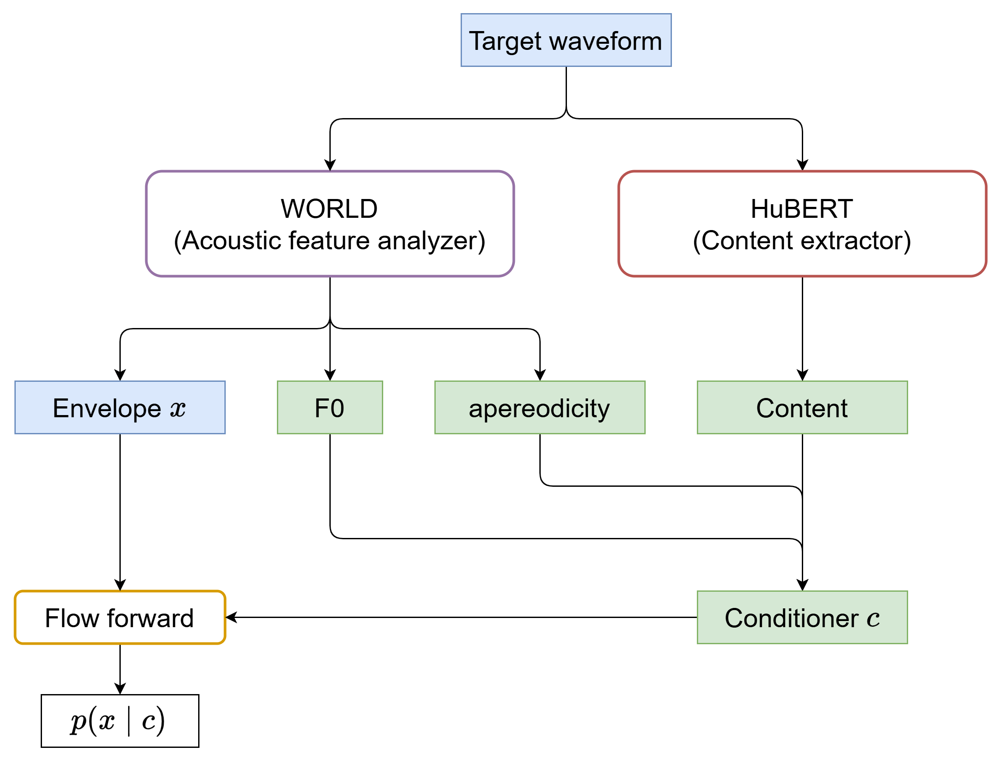
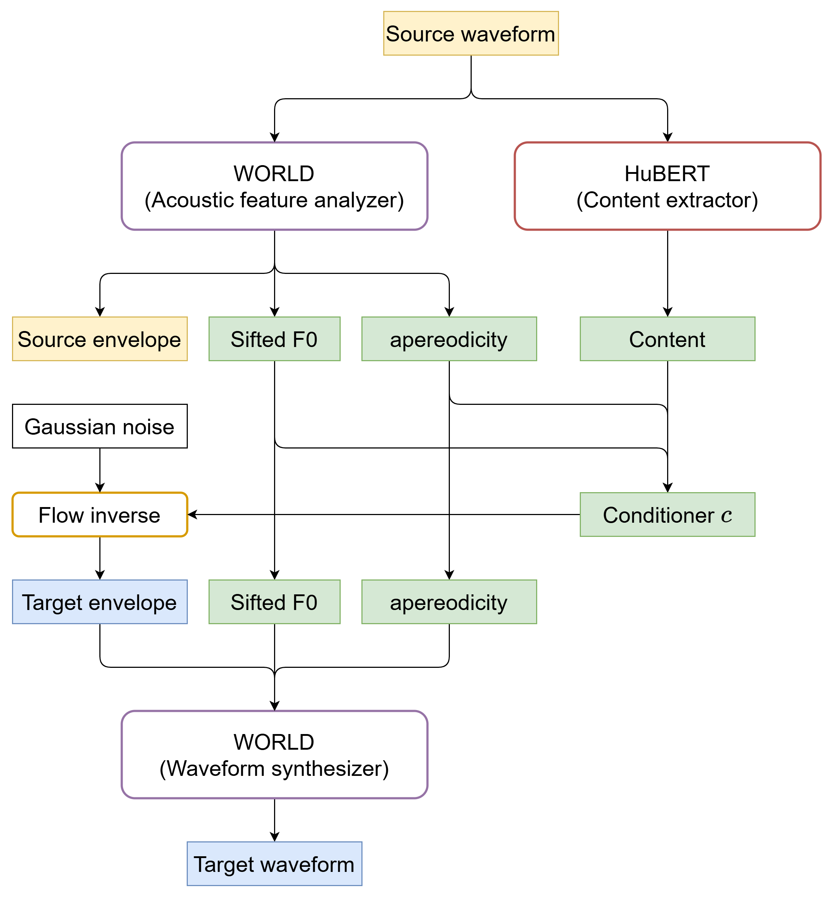
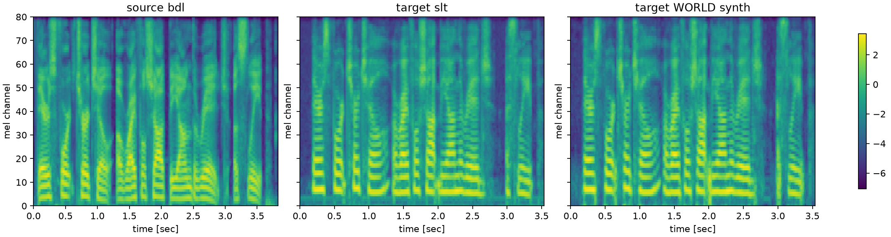

# Normalizing Flow 実装課題

[English version](README.en.md)

Normalizing Flow、特に Real NVP 系の affine coupling layer を実装し、2 次元トイデータの密度推定・サンプリングを行う課題用リポジトリです。言語系特徴で条件づけた音響特徴生成と WORLD による波形合成も用意しています。

## 概要

> [!NOTE]
>
> - 本課題では **AI ツールの使用を許可**します。ただし、可逆変換・ヤコビアン行列式・尤度計算の核心部分は自分で理解して説明できること。
> - PyTorch の基本機能は使用できますが、Normalizing Flow 専用ライブラリや既存実装の流用は禁止です（例: `normflows`, `nflows` など）。
> - コード穴埋めは `src/nf_assignment/flows/coupling.py` の `AffineCouplingTransform.forward` と `AffineCouplingTransform.inverse` です。

本課題では、標準正規分布のような単純な base distribution を、可逆なニューラルネットワークで複雑なデータ分布へ写像する **Normalizing Flow** を扱います。2 次元の Two Moons 分布を対象に、Real NVP 型の affine coupling transform を実装し、最尤学習・サンプリング・密度可視化までを行います。Speech pipeline では、同じ coupling 実装を条件付き系列 flow として利用します。

---

## 背景・課題設定

生成モデルでは、データ分布を学習して新しいサンプルを生成することが目的になります。VAE や GAN と異なり、Normalizing Flow は可逆変換と変数変換公式を使うことで、データ点の対数尤度を明示的に計算できます。

データ $x$ と潜在変数 $z$ の間に可逆写像 $z = f(x)$ があるとき、密度は次のように変換されます。

$$
\log p_X(x) = \log p_Z(f(x)) + \log \left| \det \frac{\partial f}{\partial x} \right|
$$

ただし、一般のニューラルネットワークではヤコビアン行列式の計算が高コストです。Real NVP は入力チャネルを「そのまま通す部分」と「アフィン変換する部分」に分ける affine coupling layer を使い、可逆性と log-determinant の計算しやすさを両立します。

### 学習目標

1. 変数変換公式に基づく Normalizing Flow の尤度計算を説明できる
2. Affine coupling transform の `forward` / `inverse` と log-determinant の関係を説明できる
3. 条件付き flow 応用方法法を理解する

---

## 課題

### 1. Affine Coupling Transform の実装

#### 1-1. 課題タスクの説明

`src/nf_assignment/flows/coupling.py` 内の `AffineCouplingTransform.forward` と `AffineCouplingTransform.inverse` を完成させてください。配布用コードでは、この 2 メソッドの affine 変換と log-determinant 計算部分が穴埋め対象になります。完成後、`raise NotImplementedError` がある場合は削除してください。

`AffineCouplingTransform` は Toy 専用ではありません。Toy 用の `AffineCouplingBlock` と Speech 用の `SequenceAffineCoupling` が共有する transform なので、2 次元テンソルと系列テンソルの両方で成り立つ実装にしてください。

[Density Estimation Using Real NVP](https://openreview.net/forum?id=HkpbnH9lx) の **Coupling layers** と **Properties** を参照し、次の点を自分で確認して実装してください。

- 入力のどの部分をそのまま通し、どの部分を変換するか
- conditioner が返すパラメータをどのように affine 変換へ使うか
- ヤコビアンが三角行列になる理由
- `forward` と `inverse` の log-determinant の符号関係

返り値は `(y, log_det)` とし、`y` は元の入力と同じ shape にしてください。

`mask` は Speech 課題で可変長系列の padding frame を無視するために使います。Toy の実行では通常 `mask=None` ですが、実装対象の transform 自体は Toy 専用ではありません。

穴埋めでは、次の処理方針を崩さないでください。

- `mask is not None` の場合、padding frame が log-determinant に入らない
- padding frame の出力が zero mask される

#### 1-2. 実行方法

Python 3.10 以降を使います。

```bash
python -m venv .venv
source .venv/bin/activate
python -m pip install -U pip
python -m pip install -e ".[dev]"
```

実装後、穴埋め箇所に直接関係するテストを実行してください。

```bash
python -m pytest tests/flows tests/toy tests/test_runtime_boundaries.py
```

#### 1-3. 想定結果

- `inverse(forward(x))` が元の `x` と一致する
- `forward_log_det + inverse_log_det` が 0 になる
- `log_det` の shape は常に `[batch]`
- `conditioner` の出力チャネル数が偶数でない場合はエラーになる
- `python -m pytest tests/flows tests/toy tests/test_runtime_boundaries.py` が通る

### 2. Toy データ生成

#### 2-1. 課題タスクの説明

Two Moons は 2 次元の人工データ分布です。設定は `configs/toy/data.yaml` にあり、デフォルトは `dataset: moons`, `noise: 0.18` です。

実装後、Toy pipeline で学習・サンプリング・可視化を行い、生成分布が target distribution に近づいているかを確認してください。特に、loss の推移、target/generated sample の比較、density heatmap、warped grid を見て考察してください。

#### 2-2. 実行方法

1 章のセットアップ後、Toy pipeline を実行してください。

```bash
# デフォルト設定
DEVICE=auto scripts/run_toy.sh

# 短時間の動作確認
NUM_STEPS=50 DEVICE=cpu scripts/run_toy.sh

# step 数や batch size の変更
NUM_STEPS=200 BATCH_SIZE=256 DEVICE=auto scripts/run_toy.sh

# 個別実行
python scripts/train_toy.py --device auto
python scripts/sample_toy.py --device auto --checkpoint runs/toy_realnvp/checkpoint.pt
python scripts/plot_toy.py --device auto
```

#### 2-3. 想定結果

- `runs/toy_realnvp/` に学習ログ、checkpoint、metrics が生成される
- `outputs/toy_realnvp/` に生成サンプル、density plot、warped grid plot が生成される
- target/generated sample の比較で、生成サンプルが Two Moons の形状に近づく
- density heatmap で target density と model density の対応を確認できる

想定される density heatmap の例です。



### 3. Speech 音響特徴生成

#### 3-1. 課題タスクの説明

この課題では、話者性を表すスペクトル包絡特徴系列を、その他の音声特徴で条件付けて生成するタスクを扱います。うまく学習できれば、生成時に他の話者由来の条件付け特徴を渡しても、学習話者のような包絡特徴を生成でき、音声変換が実現できます。

データセットには CMU ARCTIC を使います。デフォルトでは `bdl` と `slt` の2話者がダウンロードされます。utterance ID は train 1000、valid 100、test 32 に分割されます。デフォルトの sampling 設定は `bdl -> slt` 変換です。WORLD `coded_sp` を生成対象、HuBERT-Soft WORLD auxiliary feature などを条件特徴として使用可能です。

学習時の処理の流れは次の図を参照してください。



学習済み checkpoint を使った音声変換推論処理の流れは次の図を参照してください。



#### 3-2. 実行方法

**依存パッケージのインストール：**

```bash
python -m pip install -e ".[speech,content,dev]"
```

**データダウンロード：**

```bash
nf-prepare-speech-data --download
```

この command は `bdl` と `slt` の公式 Festvox archive を download し、`data/cmu_arctic` 以下に展開して、次のファイルを書きます。

```text
data/manifests/cmu_arctic_inventory.csv
data/manifests/cmu_arctic_splits.json
data/manifests/cmu_arctic_summary.json
```

Speaker や subset size を変える場合は `configs/speech/data.yaml` を編集するか、次のように command-line override を渡します。

```bash
nf-prepare-speech-data \
  --download \
  --speakers bdl,clb

nf-prepare-speech-data \
  --download \
  --download-speakers all

nf-prepare-speech-data \
  --download \
  --max-utterances 240
```

特徴量のダンプ：

Manifest から WORLD `coded_sp` と WORLD-frame-aligned condition features を dump します。

```bash
nf-extract-speech-features \
  --manifest data/manifests/cmu_arctic_inventory.csv \
  --speakers slt \
  --output-dir feature_cache/cmu_arctic_full \
  --split all \
  --max-utterances 1132
```

`--max-utterances` は speaker ごとの上限です。準備済みの CMU ARCTIC 全 speaker を dump する場合は、`--speakers all --max-utterances 1132` を使います。

学習、生成：

```bash
DEVICE=auto scripts/run_speech.sh
CONDITION=hubert_soft DEVICE=auto scripts/run_speech.sh
```

実験設定を変更したい場合は、`scripts/run_speech.sh` や `configs/speech` を編集してください。

Speech 依存も入れた環境では、全体テストも実行できます。

```bash
python -m pytest
```

#### 3-3. 想定結果

- `data/manifests/cmu_arctic_inventory.csv`, `data/manifests/cmu_arctic_splits.json`, `data/manifests/cmu_arctic_summary.json` が生成される
- `feature_cache/cmu_arctic_full/` に WORLD `coded_sp` と条件特徴量の cache が生成される
- `runs/speech_world_flow/` に speech flow の checkpoint と学習ログが生成される
- `outputs/speech_world_flow/` に音声変換結果、WORLD 合成音声、確認用 plot が生成される
- source / target / converted speech のメルスペクトログラムと音声を比較して、条件付き flow の挙動を考察できる

想定されるメルスペクトログラム比較と音声例です。



- [source 音声](artifacts/speech/source_bdl_arctic_a0016.wav)
- [target 音声](artifacts/speech/target_slt_arctic_a0016.wav)
- [source -> target 変換音声](artifacts/speech/target_slt_arctic_a0016_world_synthesis.wav)

---

## リポジトリ構成

```text
.
|-- README.md                         言語選択用の入口
|-- README.en.md                      英語版の概要と実行手順
|-- README.ja.md                      日本語版の課題説明と実行手順
|-- pyproject.toml                    パッケージ情報、依存関係、console script 設定
|-- .gitignore                        ローカルデータ、キャッシュ、出力物の除外設定
|-- configs/
|   |-- toy/
|   |   |-- data.yaml                 Toy 分布設定
|   |   |-- model.yaml                Toy Real NVP のモデル設定
|   |   |-- train.yaml                Toy 学習のデフォルト設定
|   |   `-- sample.yaml               Toy サンプリングのデフォルト設定
|   `-- speech/
|       |-- data.yaml                 CMU ARCTIC の download、speaker、split 設定
|       |-- features.yaml             WORLD/content 特徴抽出設定
|       |-- model.yaml                音声用条件付き flow のモデル設定
|       |-- train.yaml                音声学習のデフォルト設定とデフォルト条件
|       `-- sample.yaml               VC 風サンプリングのデフォルト設定
|-- artifacts/
|   |-- toy/
|   |   `-- density_heatmap_success.png
|   `-- speech/
|       |-- training.png
|       |-- conversion.png
|       |-- source_target_target_synthesis_mel.png
|       |-- source_bdl_arctic_a0016.wav
|       |-- target_slt_arctic_a0016.wav
|       `-- target_slt_arctic_a0016_world_synthesis.wav
|-- scripts/
|   |-- run_toy.sh                    Toy の train/sample/plot 一括実行
|   |-- train_toy.py                  Toy モデル学習 CLI
|   |-- sample_toy.py                 Toy checkpoint サンプリング CLI
|   |-- plot_toy.py                   Toy の loss、sample、density、grid plot CLI
|   |-- run_speech.sh                 Speech の train/sample/plot 一括実行
|   |-- prepare_speech_data.py        データ準備 command の entry point
|   |-- extract_speech_features.py    特徴量 dump command の entry point
|   |-- train_speech.py               音声用条件付き flow 学習 CLI
|   |-- sample_speech.py              Source-to-target VC 風サンプリング CLI
|   `-- plot_speech.py                音声 loss と生成音声確認用 plot CLI
|-- runs/
|   |-- toy_realnvp/                  Toy 学習ログ、checkpoint、metrics（実行時に生成）
|   `-- speech_world_flow/            Speech 学習ログ、checkpoint、metrics（実行時に生成）
|-- outputs/
|   |-- toy_realnvp/                  Toy 生成サンプル、density plot、grid plot（実行時に生成）
|   `-- speech_world_flow/            Speech 変換音声、WORLD 合成音声、確認用 plot（実行時に生成）
`-- src/nf_assignment/
    |-- __init__.py                   パッケージ marker
    |-- flows/
    |   |-- __init__.py               Flow subpackage marker
    |   |-- transforms.py             Transform interface と sequential container
    |   |-- distributions.py          対角 Gaussian base distribution
    |   |-- flow.py                   無条件 normalizing-flow container
    |   |-- coupling.py               共通 affine coupling transform と wrapper
    |   |-- permutation.py            Channel permutation と invertible channel mixing
    |   `-- normalization.py          Masked sequence feature 用 ActNorm
    |-- networks/
    |   |-- __init__.py               Network subpackage marker
    |   |-- mlp.py                    Toy 用 MLP conditioner
    |   |-- wavenet.py                Speech 用 WaveNet 風 Conv1d conditioner
    |   |-- adapters.py               Conditioner shape adapter module
    |   `-- conv1d.py                 Conv1d conditioner module
    |-- toy/
    |   |-- __init__.py               Toy subpackage marker
    |   |-- data.py                   sklearn 風 TwoMoons と EightGaussians の toy 分布
    |   |-- model.py                  2D Real NVP builder
    |   |-- train.py                  Toy maximum-likelihood 学習 helper
    |   |-- sample.py                 Toy checkpoint サンプリング helper
    |   `-- visualize.py              Toy plotting utility
    |-- speech/
    |   |-- __init__.py               Speech subpackage marker
    |   |-- conditions.py             Component-list 条件指定 helper
    |   |-- data.py                   CMU ARCTIC inventory、split、VC item 選択
    |   |-- prepare_data.py           CMU ARCTIC データ準備 console 実装
    |   |-- extract_features.py       WORLD/content feature-cache dump 実装
    |   |-- dataset.py                Cached feature dataset と collation
    |   |-- model.py                  条件付き sequence-flow builder
    |   |-- train.py                  音声学習 loss と loop helper
    |   |-- sample.py                 VC condition 抽出と WORLD 合成 helper
    |   |-- normalization.py          Channel-wise feature normalizer
    |   |-- visualize.py              音声 spectrogram と envelope plot utility
    |   `-- features/
    |       |-- __init__.py           Feature subpackage marker
    |       |-- world.py              PyWORLD 分析、符号化、復号、合成 wrapper
    |       |-- content.py            HuBERT-Soft/PPG 抽出と WORLD-frame alignment
    |       `-- alignment.py          Frame crop、pad、repeat、summary utility
    |-- training/
    |   |-- __init__.py               Training subpackage marker
    |   |-- checkpoints.py            Checkpoint save/load helper
    |   `-- loops.py                  共通 training-loop module
    `-- utils/
        |-- __init__.py               Utility marker
        |-- io.py                     YAML、JSON、JSONL、CSV、directory helper
        `-- seed.py                   Python/NumPy/PyTorch RNG seed helper
```

---

## 発表内容（次回）

1. **実装した affine coupling transform の説明**

   - `forward` と `inverse` の式
   - log-determinant の導出

2. **実験結果**

   - loss curve
   - target / generated sample の比較
   - density heatmap

3. **考察**

   - 生成分布と target distribution の比較
   - 余裕があれば、他話者化や品質改善などご自由に

---

## 注意事項

- 自分の作業ブランチで課題を行うこと
- プルリクエストを送る際には **Loss 推移グラフと密度ヒートマップ、音響特徴ヒートマップを載せること**
- 作業前にリポジトリを最新版に更新すること

---

## 参考文献

- [Density Estimation Using Real NVP](https://openreview.net/forum?id=HkpbnH9lx) — Dinh et al. (2017)：affine coupling layer と変数変換による密度推定の主な参照文献
- [NICE: Non-linear Independent Components Estimation](https://arxiv.org/abs/1410.8516) — Dinh et al. (2015)：coupling layer を用いた初期の flow-based 生成モデル
- [Variational Inference with Normalizing Flows](https://proceedings.mlr.press/v37/rezende15.html) — Rezende & Mohamed (2015)：normalizing flow という枠組みを変分推論に導入した文献
- [Glow: Generative Flow with Invertible 1x1 Convolutions](https://proceedings.neurips.cc/paper/2018/hash/d139db6a236200b21cc7f752979132d0-Abstract.html) — Kingma & Dhariwal (2018)：Real NVP 系 flow を拡張した画像生成モデル
- [WaveGlow: A Flow-based Generative Network for Speech Synthesis](https://doi.org/10.1109/ICASSP.2019.8683143) — Prenger et al. (2019)：flow を音声生成に応用した例
- [Glow-TTS: A Generative Flow for Text-to-Speech via Monotonic Alignment Search](https://arxiv.org/abs/2005.11129) — Kim et al. (2020)：flow-based decoder を用いた並列 TTS の例
